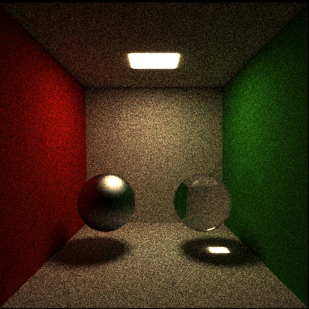

# Physically Based Rendering Tracing (PBRT)

PBRT is a philosophy in computer graphics that seeks to render graphics in a way that more accurately models
the flow of light in the real world. This code is a project developed during the PBRT course, in the 
Federal University of Paraiba, Brazil.



 ## Getting Started
 
 These instructions will get you a copy of the project up and running on your local machine for development and testing purposes.
 
 ### Prerequisites
 
 What things you need to install the software and how to install them
 
 ```
 G++ or compatible installed.
 Assimp - Open Asset Import Library
 GLM - OpenGL Mathematics
 ```
 
 ### Compile and Run
 
 To run the code in LINUX, in the directoy file:
 
 ```
 make
 ```
 
 And next:
 
 ```
 ./pathtracer
 ```
